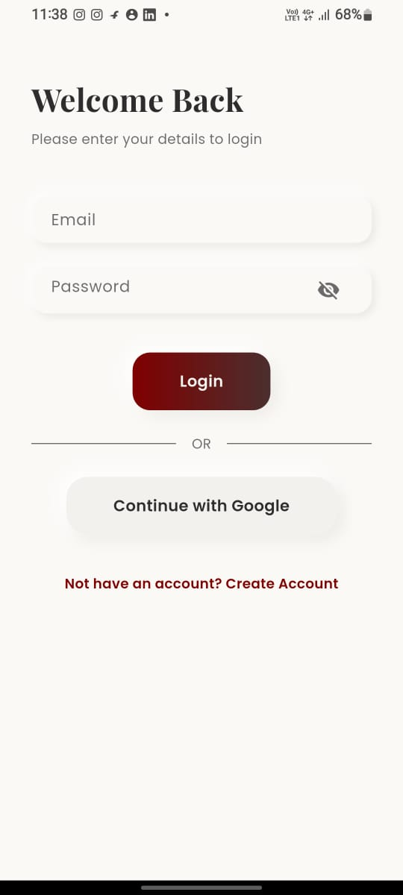
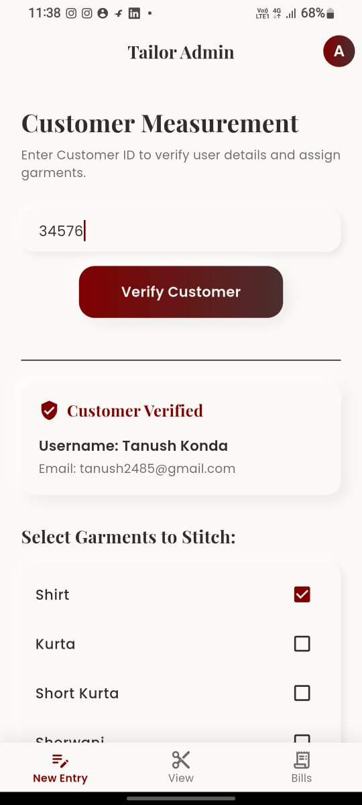
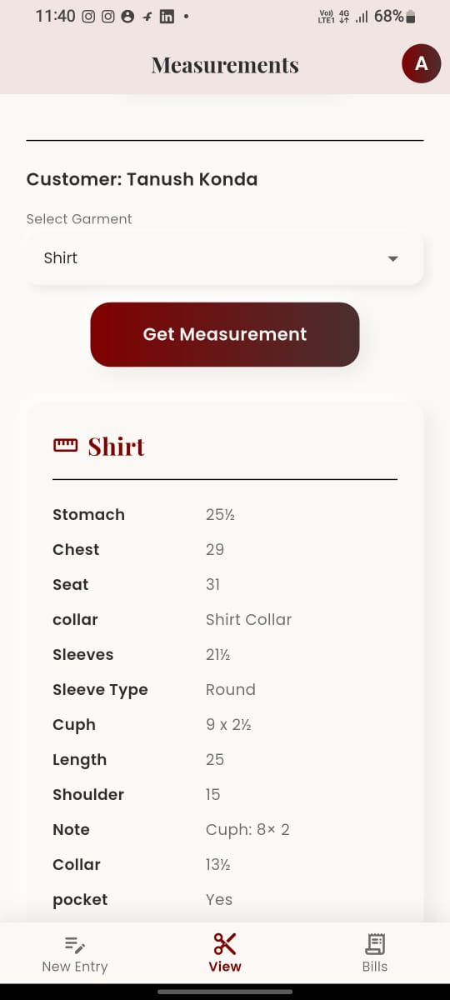
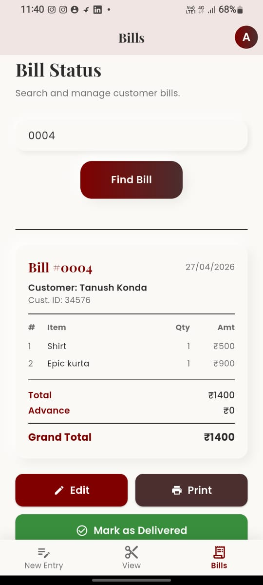

<div align="center">
  
  <h1>R.K. Tailors Mobile App</h1>
  <p>A full-stack, B2C tailoring management system built with Flutter and Firebase.</p>

  
  
  
</div>

<br/>

## 📝 Overview
The R.K. Tailors Mobile App is a comprehensive solution designed to digitize the workflow of a physical tailoring business. It provides a seamless, secure, and intuitive platform for the admin (tailor) to manage customer measurements, track orders, and generate invoices, while offering a self-service portal for customers to view their records and download their bills.

## ✨ Key Features

### 🔐 Role-Based Access Control (RBAC)
- Secure Google OAuth integration.
- Dedicated **Admin Dashboard** for business operations and a **Customer Portal** for end-users.

### 📏 Advanced Measurement Management
- Dynamic, deeply nested forms supporting 10+ distinct garment types (Shirts, Pants, Kurtas, etc.).
- **Smart Auto-Fill**: Instantly queries the database for returning customers and pre-populates previous measurements to streamline data entry.
- Visual reference support: Capture up to 4 custom reference images per garment using the device camera or gallery.

### 💰 Robust Billing & Invoicing
- **Offline PDF Engine**: Programmatically generates branded A5 vector PDF invoices entirely on-device using the `pdf` and `printing` packages.
- Dynamic cart system with incremental item quantities, subtotal, advance payment, and grand total calculations.
- **Collision-Free Numbering**: Utilizes Firestore Atomic Transactions (`runTransaction`) to guarantee sequential bill numbers (0001–9999), completely preventing duplicates.

### ☁️ Zero-Cost Storage Architecture
- Engineered a highly optimized image compression pipeline.
- Images are captured, locally compressed (max 600px, 20% quality), and encoded as Base64 strings.
- Images are stored directly within NoSQL Firestore text documents, bypassing Firebase Cloud Storage limitations and costs entirely.

### 🎨 Neumorphic UI Design
- Crafted using a custom Neumorphic design system, providing a modern, tactile, "soft UI" experience with dynamic light and shadow mapping across all interactive elements.

---

## 🛠️ Technology Stack
- **Framework:** Flutter (Dart)
- **Backend & Database:** Firebase Authentication, Cloud Firestore
- **Key Packages:** 
  - `pdf` & `printing` (Invoice Generation)
  - `google_sign_in` (Authentication)
  - `image_picker` (Native Camera/Gallery)
  - `flutter_launcher_icons` (Adaptive App Icons)

---

## 🚀 Getting Started

### Prerequisites
- [Flutter SDK](https://docs.flutter.dev/get-started/install) (v3.10.0 or higher)
- Android Studio / VS Code
- A configured Firebase Project (ensure `google-services.json` is added to `android/app/`).

### Installation
1. **Clone the repository**
   ```bash
   git clone https://github.com/tanushkonda03-ops/R.-K.-Tailors.git
   cd R.-K.-Tailors
   ```

2. **Install dependencies**
   ```bash
   flutter pub get
   ```

3. **Run the app**
   ```bash
   flutter run
   ```

---

## 📸 Screenshots

<div align="center">
  
  &nbsp;&nbsp;&nbsp;
  
  &nbsp;&nbsp;&nbsp;
  
  &nbsp;&nbsp;&nbsp;
  
</div>


---

<div align="center">
  <p>Designed and Developed for R.K. Tailors.</p>
</div>
